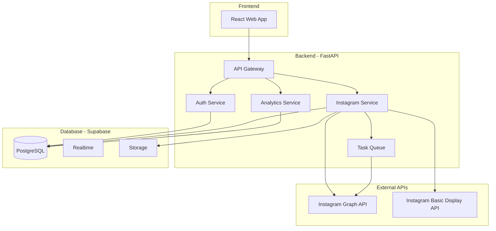

# TASK-002 결과

생성 시간: 2026-02-02T18:17:43.497974

---

## 시스템 아키텍처 설계

### 아키텍처 개요



### 시스템 구성 요소

#### 1. **Frontend Layer**
- React 기반 SPA
- 인증 및 인스타그램 OAuth 연동
- 실시간 데이터 업데이트 (Supabase Realtime)

#### 2. **Backend Services**
- **API Gateway**: 모든 요청의 진입점
- **Auth Service**: 사용자 인증/인가, 토큰 관리
- **Instagram Service**: IG API 연동, 데이터 수집
- **Analytics Service**: 인사이트 계산 및 분석
- **Task Queue**: 주기적 데이터 수집 작업 관리

#### 3. **External Integration**
- Instagram Graph API: 비즈니스 계정 데이터
- Instagram Basic Display API: 개인 계정 데이터

---

## DB 스키마 설계

### 테이블 구조

#### 1. **users** (사용자)
```sql
CREATE TABLE users (
    id UUID PRIMARY KEY DEFAULT gen_random_uuid(),
    email TEXT UNIQUE NOT NULL,
    username TEXT UNIQUE NOT NULL,
    full_name TEXT,
    avatar_url TEXT,
    instagram_user_id TEXT UNIQUE,
    instagram_username TEXT,
    account_type TEXT CHECK (account_type IN ('personal', 'business', 'creator')),
    is_active BOOLEAN DEFAULT true,
    created_at TIMESTAMPTZ DEFAULT NOW(),
    updated_at TIMESTAMPTZ DEFAULT NOW()
);
```

#### 2. **instagram_accounts** (인스타그램 계정 연동)
```sql
CREATE TABLE instagram_accounts (
    id UUID PRIMARY KEY DEFAULT gen_random_uuid(),
    user_id UUID REFERENCES users(id) ON DELETE CASCADE,
    instagram_user_id TEXT UNIQUE NOT NULL,
    access_token TEXT NOT NULL,
    token_type TEXT DEFAULT 'bearer',
    expires_at TIMESTAMPTZ,
    refresh_token TEXT,
    permissions TEXT[], -- ['pages_show_list', 'instagram_basic', etc.]
    last_sync_at TIMESTAMPTZ,
    sync_status TEXT DEFAULT 'pending',
    created_at TIMESTAMPTZ DEFAULT NOW(),
    updated_at TIMESTAMPTZ DEFAULT NOW()
);
```

#### 3. **media_posts** (미디어 게시물)
```sql
CREATE TABLE media_posts (
    id UUID PRIMARY KEY DEFAULT gen_random_uuid(),
    instagram_account_id UUID REFERENCES instagram_accounts(id) ON DELETE CASCADE,
    instagram_media_id TEXT UNIQUE NOT NULL,
    media_type TEXT CHECK (media_type IN ('IMAGE', 'VIDEO', 'CAROUSEL_ALBUM', 'REELS')),
    media_url TEXT,
    thumbnail_url TEXT,
    permalink TEXT,
    caption TEXT,
    hashtags TEXT[],
    mentioned_users TEXT[],
    posted_at TIMESTAMPTZ NOT NULL,
    is_deleted BOOLEAN DEFAULT false,
    created_at TIMESTAMPTZ DEFAULT NOW(),
    updated_at TIMESTAMPTZ DEFAULT NOW()
);

CREATE INDEX idx_media_posts_account_posted ON media_posts(instagram_account_id, posted_at DESC);
```

#### 4. **media_insights** (미디어 인사이트)
```sql
CREATE TABLE media_insights (
    id UUID PRIMARY KEY DEFAULT gen_random_uuid(),
    media_post_id UUID REFERENCES media_posts(id) ON DELETE CASCADE,
    metric_date DATE NOT NULL,
    impressions INTEGER DEFAULT 0,
    reach INTEGER DEFAULT 0,
    engagement INTEGER DEFAULT 0,
    saves INTEGER DEFAULT 0,
    shares INTEGER DEFAULT 0,
    likes INTEGER DEFAULT 0,
    comments INTEGER DEFAULT 0,
    profile_visits INTEGER DEFAULT 0,
    website_clicks INTEGER DEFAULT 0,
    created_at TIMESTAMPTZ DEFAULT NOW(),
    updated_at TIMESTAMPTZ DEFAULT NOW(),
    UNIQUE(media_post_id, metric_date)
);

CREATE INDEX idx_media_insights_post_date ON media_insights(media_post_id, metric_date DESC);
```

#### 5. **account_insights** (계정 인사이트)
```sql
CREATE TABLE account_insights (
    id UUID PRIMARY KEY DEFAULT gen_random_uuid(),
    instagram_account_id UUID REFERENCES instagram_accounts(id) ON DELETE CASCADE,
    metric_date DATE NOT NULL,
    followers_count INTEGER DEFAULT 0,
    following_count INTEGER DEFAULT 0,
    posts_count INTEGER DEFAULT 0,
    daily_followers_gain INTEGER DEFAULT 0,
    daily_followers_loss INTEGER DEFAULT 0,
    impressions INTEGER DEFAULT 0,
    reach INTEGER DEFAULT 0,
    profile_views INTEGER DEFAULT 0,
    website_clicks INTEGER DEFAULT 0,
    email_contacts INTEGER DEFAULT 0,
    created_at TIMESTAMPTZ DEFAULT NOW(),
    updated_at TIMESTAMPTZ DEFAULT NOW(),
    UNIQUE(instagram_account_id, metric_date)
);

CREATE INDEX idx_account_insights_account_date ON account_insights(instagram_account_id, metric_date DESC);
```

#### 6. **sync_logs** (동기화 로그)
```sql
CREATE TABLE sync_logs (
    id UUID PRIMARY KEY DEFAULT gen_random_uuid(),
    instagram_account_id UUID REFERENCES instagram_accounts(id) ON DELETE CASCADE,
    sync_type TEXT CHECK (sync_type IN ('media', 'insights', 'profile')),
    status TEXT CHECK (status IN ('started', 'completed', 'failed')),
    error_message TEXT,
    items_processed INTEGER DEFAULT 0,
    started_at TIMESTAMPTZ DEFAULT NOW(),
    completed_at TIMESTAMPTZ
);
```

### Row Level Security (RLS) 정책
```sql
-- 사용자는 자신의 데이터만 조회 가능
ALTER TABLE instagram_accounts ENABLE ROW LEVEL SECURITY;
CREATE POLICY "Users can view own instagram accounts" ON instagram_accounts
    FOR ALL USING (auth.uid() = user_id);

ALTER TABLE media_posts ENABLE ROW LEVEL SECURITY;
CREATE POLICY "Users can view own media posts" ON media_posts
    FOR SELECT USING (
        instagram_account_id IN (
            SELECT id FROM instagram_accounts WHERE user_id = auth.uid()
        )
    );
```

---

## API 엔드포인트 설계

### 인증 관련
| 엔드포인트 | 메서드 | 설명 | 요청 | 응답 |
|-----------|--------|------|------|------|
| `/api/v1/auth/register` | POST | 회원가입 | `{email, password, username}` | `{user, token}` |
| `/api/v1/auth/login` | POST | 로그인 | `{email, password}` | `{user, token}` |
| `/api/v1/auth/instagram/connect` | GET | Instagram OAuth 시작 | - | Redirect to Instagram |
| `/api/v1/auth/instagram/callback` | GET | Instagram OAuth 콜백 | `?code=` | `{success, account_id}` |

### 계정 관리
| 엔드포인트 | 메서드 | 설명 | 요청 | 응답 |
|-----------|--------|------|------|------|
| `/api/v1/accounts` | GET | 연동된 계정 목록 | - | `{accounts[]}` |
| `/api/v1/accounts/{id}` | GET | 계정 상세 정보 | - | `{account, stats}` |
| `/api/v1/accounts/{id}/sync` | POST | 수동 동기화 시작 | `{sync_type}` | `{sync_id, status}` |
| `/api/v1/accounts/{id}` | DELETE | 계정 연동 해제 | - | `{success}` |

### 미디어 관련
| 엔드포인트 | 메서드 | 설명 | 요청 | 응답 |
|-----------|--------|------|------|------|
| `/api/v1/media` | GET | 미디어 목록 | `?account_id=&page=&limit=` | `{media[], total, page}` |
| `/api/v1/media/{id}` | GET | 미디어 상세 | - | `{media, insights}` |
| `/api/v1/media/{id}/insights` | GET | 미디어 인사이트 | `?date_from=&date_to=` | `{insights[]}` |

### 분석/인사이트
| 엔드포인트 | 메서드 | 설명 | 요청 | 응답 |
|-----------|--------|------|------|------|
| `/api/v1/insights/overview` | GET | 계정 개요 | `?account_id=&period=` | `{stats, trends}` |
| `/api/v1/insights/growth` | GET | 성장 분석 | `?account_id=&date_from=&date_to=` | `{growth_data[]}` |
| `/api/v1/insights/engagement` | GET | 참여율 분석 | `?account_id=&period=` | `{engagement_data}` |
| `/api/v1/insights/best-posts` | GET | 인기 게시물 | `?account_id=&metric=&limit=` | `{posts[]}` |

### 동기화 상태
| 엔드포인트 | 메서드 | 설명 | 요청 | 응답 |
|-----------|--------|------|------|------|
| `/api/v1/sync/status` | GET | 동기화 상태 확인 | `?account_id=` | `{syncs[], last_sync}` |
| `/api/v1/sync/logs` | GET | 동기화 로그 | `?account_id=&limit=` | `{logs[]}` |

---

## 기술적 고려사항 및 위험 관리

### 1. **Instagram API 제한사항**
- **위험**: Rate limiting (시간당 200 요청)
- **대응**: 
  - Redis 기반 요청 큐 구현
  - 백그라운드 작업으로 데이터 수집
  - 캐싱 전략 수립

### 2. **토큰 관리**
- **위험**: Access token 만료 (60일)
- **대응**:
  - 토큰 갱신 자동화
  - 만료 7일 전 사용자 알림

### 3. **대용량 데이터 처리**
- **위험**: 많은 게시물을 가진 계정의 초기 동기화
- **대응**:
  - 페이지네이션 구현
  - 점진적 데이터 로딩
  - 우선순위 기반 동기화

### 4. **실시간성**
- **위험**: Instagram API는 실시간 데이터 제공 안함
- **대응**:
  - 주기적 폴링 (하루 2-3회)
  - Supabase Realtime으로 클라이언트 업데이트

### 5. **보안**
- **위험**: 민감한 토큰 정보 노출
- **대응**:
  - 모든 토큰 암호화 저장
  - Row Level Security 적용
  - API 키 환경변수 관리

---

## CLAUDE.md 업데이트 사항

```yaml
기술 스택:
  Backend: 
    - Python 3.11+
    - FastAPI
    - Celery (작업 큐)
    - Redis (캐싱)
  Database: 
    - Supabase (PostgreSQL)
    - Row Level Security 활용
  Frontend: 
    - React 18+
    - TypeScript
    - Supabase JS Client
  External APIs:
    - Instagram Graph API
    - Instagram Basic Display API
  배포: 
    - Backend: Railway
    - Frontend: Vercel
    - Queue: Redis Cloud
```

## 다음 단계
1. Backend Developer가 FastAPI 프로젝트 구조 설정
2. Frontend Developer가 React 프로젝트 초기화
3. Supabase 프로젝트 생성 및 스키마 적용