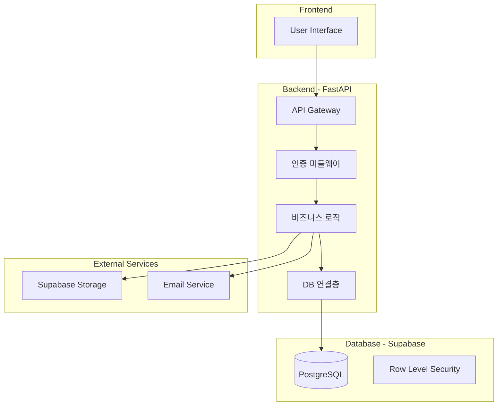

# TASK-039 결과

생성 시간: 2026-02-02T17:53:28.574037

---

# 시스템 설계 문서

## 아키텍처 개요



## 기술적 차단 요소 해결 방안

### 1. 인증/인가 시스템
**문제**: Supabase Auth와 FastAPI 통합 시 토큰 검증 이슈
**해결방안**:
```python
# middleware/auth.py
from fastapi import HTTPException, Depends
from supabase import create_client
import jwt

async def verify_token(authorization: str = Header(None)):
    if not authorization:
        raise HTTPException(401, "Missing authorization")
    
    try:
        # Supabase JWT 검증
        token = authorization.replace("Bearer ", "")
        payload = jwt.decode(token, options={"verify_signature": False})
        return payload
    except:
        raise HTTPException(401, "Invalid token")
```

### 2. 데이터베이스 연결 풀링
**문제**: Supabase 연결 제한 및 성능 이슈
**해결방안**:
- 연결 풀 설정 최적화
- 비동기 처리 적용
```python
# core/database.py
from supabase import create_client, Client
from functools import lru_cache

@lru_cache()
def get_supabase_client() -> Client:
    return create_client(
        supabase_url=settings.SUPABASE_URL,
        supabase_key=settings.SUPABASE_KEY
    )
```

### 3. 파일 업로드 처리
**문제**: 대용량 파일 업로드 시 메모리 이슈
**해결방안**:
- 스트리밍 업로드 구현
- Supabase Storage 직접 업로드 URL 사용

## API 명세

| 엔드포인트 | 메서드 | 설명 | 요청 | 응답 |
|-----------|--------|------|------|------|
| `/api/auth/register` | POST | 회원가입 | `{email, password}` | `{user, access_token}` |
| `/api/auth/login` | POST | 로그인 | `{email, password}` | `{user, access_token}` |
| `/api/users/me` | GET | 내 정보 조회 | - | `{user_data}` |
| `/api/files/upload-url` | POST | 업로드 URL 생성 | `{filename, content_type}` | `{upload_url, file_id}` |
| `/api/files/{id}` | GET | 파일 조회 | - | `{file_metadata}` |

## DB 스키마

### users 테이블
```sql
CREATE TABLE users (
    id UUID PRIMARY KEY DEFAULT gen_random_uuid(),
    email TEXT UNIQUE NOT NULL,
    created_at TIMESTAMPTZ DEFAULT NOW(),
    updated_at TIMESTAMPTZ DEFAULT NOW()
);

-- RLS 정책
ALTER TABLE users ENABLE ROW LEVEL SECURITY;

CREATE POLICY "Users can view own profile" 
ON users FOR SELECT 
USING (auth.uid() = id);
```

### files 테이블
```sql
CREATE TABLE files (
    id UUID PRIMARY KEY DEFAULT gen_random_uuid(),
    user_id UUID REFERENCES users(id),
    filename TEXT NOT NULL,
    size BIGINT,
    content_type TEXT,
    storage_path TEXT,
    created_at TIMESTAMPTZ DEFAULT NOW()
);

-- 인덱스
CREATE INDEX idx_files_user_id ON files(user_id);
```

## 프로젝트 구조
```
project/
├── app/
│   ├── api/
│   │   ├── auth.py
│   │   ├── users.py
│   │   └── files.py
│   ├── core/
│   │   ├── config.py
│   │   ├── database.py
│   │   └── security.py
│   ├── middleware/
│   │   └── auth.py
│   ├── models/
│   │   └── schemas.py
│   └── main.py
├── tests/
├── .env.example
├── requirements.txt
└── README.md
```

## 기술적 위험 및 대응방안

### 위험 1: Supabase 무료 티어 제한
- **대응**: 
  - 연결 풀 최적화
  - 캐싱 전략 구현
  - 모니터링 설정

### 위험 2: 실시간 기능 확장성
- **대응**:
  - WebSocket 대신 Server-Sent Events 고려
  - 폴링 방식 백업 플랜

### 위험 3: 보안 취약점
- **대응**:
  - CORS 설정 엄격화
  - Rate limiting 구현
  - Input validation 강화

## CLAUDE.md 업데이트 사항
- 기술 스택에 미들웨어 레이어 추가
- Supabase RLS 활용 방침 명시
- 에러 처리 표준화 가이드 추가

## 다음 단계
1. Backend Developer가 core 모듈 구현
2. API 엔드포인트 순차 개발
3. 통합 테스트 환경 구축